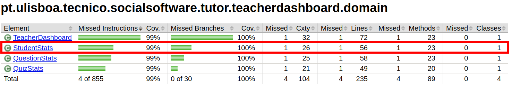
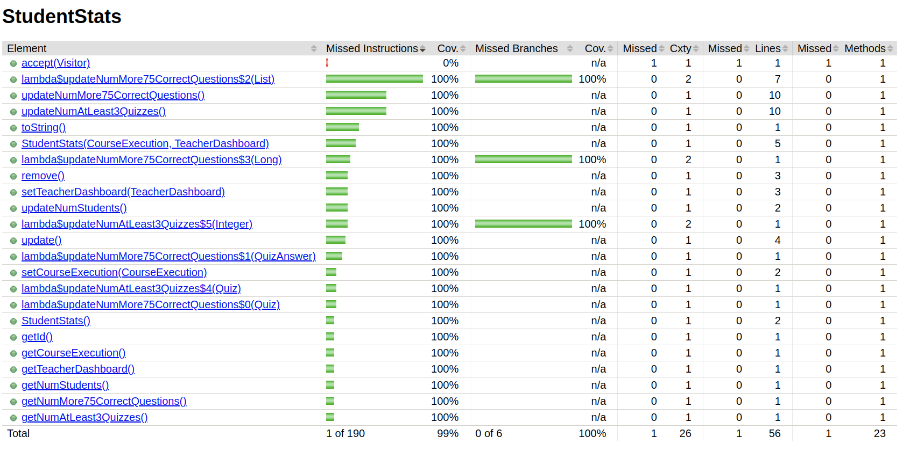
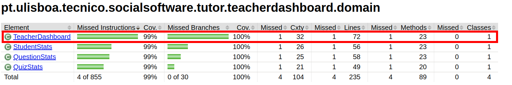

# ES P1 submission, Group 64

## Feature ESA

### Subgroup

- Diogo Cardoso, ist199209, [GitLab link](https://gitlab.rnl.tecnico.ulisboa.pt/ist199209)
    + Issues (and tasks) assigned:
        - [#1](https://gitlab.rnl.tecnico.ulisboa.pt/es/es23-64/-/issues/1)
        - [#2](https://gitlab.rnl.tecnico.ulisboa.pt/es/es23-64/-/issues/2)
        - [#10](https://gitlab.rnl.tecnico.ulisboa.pt/es/es23-64/-/work_items/3949)
        - [#11](https://gitlab.rnl.tecnico.ulisboa.pt/es/es23-64/-/work_items/3950)
        - [#12](https://gitlab.rnl.tecnico.ulisboa.pt/es/es23-64/-/work_items/3951)
        - [#13](https://gitlab.rnl.tecnico.ulisboa.pt/es/es23-64/-/work_items/3952)
        - [#14](https://gitlab.rnl.tecnico.ulisboa.pt/es/es23-64/-/work_items/3953)
        - [#17](https://gitlab.rnl.tecnico.ulisboa.pt/es/es23-64/-/work_items/3961)
        - [#45](https://gitlab.rnl.tecnico.ulisboa.pt/es/es23-64/-/issues/45)
- Diogo Correia, ist199211, [GitLab link](https://gitlab.rnl.tecnico.ulisboa.pt/ist199211)
    + Issues (and tasks) assigned:
        - [#2](https://gitlab.rnl.tecnico.ulisboa.pt/es/es23-64/-/issues/2)
        - [#3](https://gitlab.rnl.tecnico.ulisboa.pt/es/es23-64/-/issues/3)
        - [#15](https://gitlab.rnl.tecnico.ulisboa.pt/es/es23-64/-/work_items/3959)
        - [#16](https://gitlab.rnl.tecnico.ulisboa.pt/es/es23-64/-/work_items/3960)
        - [#18](https://gitlab.rnl.tecnico.ulisboa.pt/es/es23-64/-/work_items/3962)
        - [#19](https://gitlab.rnl.tecnico.ulisboa.pt/es/es23-64/-/work_items/3963)
        - [#20](https://gitlab.rnl.tecnico.ulisboa.pt/es/es23-64/-/work_items/3964)

### Merge requests associated with this feature

The list of pull requests associated with this feature is:

- [MR !1](https://gitlab.rnl.tecnico.ulisboa.pt/es/es23-64/-/merge_requests/1)
- [MR !4](https://gitlab.rnl.tecnico.ulisboa.pt/es/es23-64/-/merge_requests/4)
- [MR !5](https://gitlab.rnl.tecnico.ulisboa.pt/es/es23-64/-/merge_requests/5)
- [MR !12](https://gitlab.rnl.tecnico.ulisboa.pt/es/es23-64/-/merge_requests/12)

### Test Coverage Screenshot

The screenshots include the test coverage results associated with the new/changed entities:

---

## Feature ESQ

### Subgroup

- Diogo Gaspar, ist199207, [GitLab link](https://gitlab.rnl.tecnico.ulisboa.pt/ist199207)
    + Issues (and tasks) assigned:
        - [#4](https://gitlab.rnl.tecnico.ulisboa.pt/es/es23-64/-/issues/4)
        - [#6](https://gitlab.rnl.tecnico.ulisboa.pt/es/es23-64/-/issues/6)
        - [#21](https://gitlab.rnl.tecnico.ulisboa.pt/es/es23-64/-/work_items/4444)
        - [#22](https://gitlab.rnl.tecnico.ulisboa.pt/es/es23-64/-/work_items/4445)
        - [#23](https://gitlab.rnl.tecnico.ulisboa.pt/es/es23-64/-/work_items/4446)
        - [#24](https://gitlab.rnl.tecnico.ulisboa.pt/es/es23-64/-/work_items/4448)
        - [#25](https://gitlab.rnl.tecnico.ulisboa.pt/es/es23-64/-/work_items/4449)
        - [#29](https://gitlab.rnl.tecnico.ulisboa.pt/es/es23-64/-/work_items/4589)
        - [#30](https://gitlab.rnl.tecnico.ulisboa.pt/es/es23-64/-/work_items/4590)
        - [#31](https://gitlab.rnl.tecnico.ulisboa.pt/es/es23-64/-/work_items/4591)

- Tomás Esteves, is1199341, [GitLab link](https://gitlab.rnl.tecnico.ulisboa.pt/ist199341)
    + Issues (and tasks) assigned:
        - [#5](https://gitlab.rnl.tecnico.ulisboa.pt/es/es23-64/-/issues/5)
        - [#26](https://gitlab.rnl.tecnico.ulisboa.pt/es/es23-64/-/work_items/4453)
        - [#27](https://gitlab.rnl.tecnico.ulisboa.pt/es/es23-64/-/work_items/4454)
        - [#28](https://gitlab.rnl.tecnico.ulisboa.pt/es/es23-64/-/work_items/4455)
        - [#43](https://gitlab.rnl.tecnico.ulisboa.pt/es/es23-64/-/issues/43)
        - [#44](https://gitlab.rnl.tecnico.ulisboa.pt/es/es23-64/-/issues/44)
        - [#46](https://gitlab.rnl.tecnico.ulisboa.pt/es/es23-64/-/issues/46)
        - [#47](https://gitlab.rnl.tecnico.ulisboa.pt/es/es23-64/-/issues/47)

### Merge requests associated with this feature

The list of pull requests associated with this feature is:

- [MR !2](https://gitlab.rnl.tecnico.ulisboa.pt/es/es23-64/-/merge_requests/2)
- [MR !6](https://gitlab.rnl.tecnico.ulisboa.pt/es/es23-64/-/merge_requests/6)
- [MR !7](https://gitlab.rnl.tecnico.ulisboa.pt/es/es23-64/-/merge_requests/7)
- [MR !9](https://gitlab.rnl.tecnico.ulisboa.pt/es/es23-64/-/merge_requests/9)

### Test Coverage Screenshot

The screenshots include the test coverage results associated with the new/changed entities:

---

## Feature ESP

### Subgroup
- Rafael Oliveira, ist199311, [GitLab link](https://gitlab.rnl.tecnico.ulisboa.pt/ist199311)
    + Issues (and tasks) assigned:
        - [#8](https://gitlab.rnl.tecnico.ulisboa.pt/es/es23-64/-/issues/8)
        - [#9](https://gitlab.rnl.tecnico.ulisboa.pt/es/es23-64/-/issues/9)
        - [#37](https://gitlab.rnl.tecnico.ulisboa.pt/es/es23-64/-/work_items/4923)
        - [#38](https://gitlab.rnl.tecnico.ulisboa.pt/es/es23-64/-/work_items/4924)
        - [#39](https://gitlab.rnl.tecnico.ulisboa.pt/es/es23-64/-/work_items/4926)
        - [#42](https://gitlab.rnl.tecnico.ulisboa.pt/es/es23-64/-/work_items/4931)

- Tiago Silva, ist199335, [GitLab link](https://gitlab.rnl.tecnico.ulisboa.pt/ist199335)
    + Issues (and tasks) assigned:
        - [#7](https://gitlab.rnl.tecnico.ulisboa.pt/es/es23-64/-/issues/7)
        - [#9](https://gitlab.rnl.tecnico.ulisboa.pt/es/es23-64/-/issues/9)
        - [#32](https://gitlab.rnl.tecnico.ulisboa.pt/es/es23-64/-/work_items/4914)
        - [#33](https://gitlab.rnl.tecnico.ulisboa.pt/es/es23-64/-/work_items/4915)
        - [#34](https://gitlab.rnl.tecnico.ulisboa.pt/es/es23-64/-/work_items/4917)
        - [#35](https://gitlab.rnl.tecnico.ulisboa.pt/es/es23-64/-/work_items/4918)
        - [#36](https://gitlab.rnl.tecnico.ulisboa.pt/es/es23-64/-/work_items/4919)
        - [#40](https://gitlab.rnl.tecnico.ulisboa.pt/es/es23-64/-/work_items/4929)
        - [#41](https://gitlab.rnl.tecnico.ulisboa.pt/es/es23-64/-/work_items/4930)

### Merge requests associated with this feature

The list of pull requests associated with this feature is:

- [MR !3](https://gitlab.rnl.tecnico.ulisboa.pt/es/es23-64/-/merge_requests/3)
- [MR !8](https://gitlab.rnl.tecnico.ulisboa.pt/es/es23-64/-/merge_requests/8)
- [MR !11](https://gitlab.rnl.tecnico.ulisboa.pt/es/es23-64/-/merge_requests/11)

### Test Coverage Screenshot

The screenshots include the test coverage results associated with the new/changed entities:

---

## Teacher Dashboard

The screenshots include the test coverage results associated with the teacherDashboard after all the features were implemented:

---

## Additional Merge Requests

There was an additional Merge Request done in this Submission, the one related to
the delivery of this Submission Summary file: [MR !10](https://gitlab.rnl.tecnico.ulisboa.pt/es/es23-64/-/merge_requests/10).
Its related issue can be found [here](https://gitlab.rnl.tecnico.ulisboa.pt/es/es23-64/-/issues/43), with
assignee Tomás Esteves.
