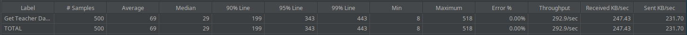
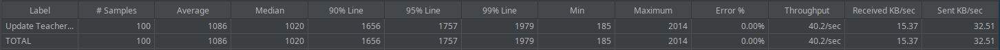
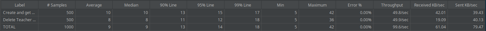

# ES P3 submission, Group 64

## Did your group use the base code provided?

No, but we made sure to fix the problems identified at the second submission's feedback session.

## Feature ESA

### Subgroup

-   Diogo Cardoso, ist199209, [GitLab link](https://gitlab.rnl.tecnico.ulisboa.pt/ist199209)
    -   Issues assigned: [#97](https://gitlab.rnl.tecnico.ulisboa.pt/es/es23-64/-/issues/97), [#100](https://gitlab.rnl.tecnico.ulisboa.pt/es/es23-64/-/issues/100), [#101](https://gitlab.rnl.tecnico.ulisboa.pt/es/es23-64/-/issues/101), [#109](https://gitlab.rnl.tecnico.ulisboa.pt/es/es23-64/-/issues/109), [#110](https://gitlab.rnl.tecnico.ulisboa.pt/es/es23-64/-/issues/110), [#116](https://gitlab.rnl.tecnico.ulisboa.pt/es/es23-64/-/issues/116), [#120](https://gitlab.rnl.tecnico.ulisboa.pt/es/es23-64/-/issues/120), [#123](https://gitlab.rnl.tecnico.ulisboa.pt/es/es23-64/-/issues/123), [#124](https://gitlab.rnl.tecnico.ulisboa.pt/es/es23-64/-/issues/124)
-   Diogo Correia, ist199211, [GitLab link](https://gitlab.rnl.tecnico.ulisboa.pt/ist199211)
    -   Issues assigned: [#94](https://gitlab.rnl.tecnico.ulisboa.pt/es/es23-64/-/issues/94), [#100](https://gitlab.rnl.tecnico.ulisboa.pt/es/es23-64/-/issues/100), [#103](https://gitlab.rnl.tecnico.ulisboa.pt/es/es23-64/-/issues/103), [#104](https://gitlab.rnl.tecnico.ulisboa.pt/es/es23-64/-/issues/104), [#116](https://gitlab.rnl.tecnico.ulisboa.pt/es/es23-64/-/issues/116), [#117](https://gitlab.rnl.tecnico.ulisboa.pt/es/es23-64/-/issues/117)

### Merge requests associated with this feature

The list of pull requests associated with this feature is:

-   [MR !29](https://gitlab.rnl.tecnico.ulisboa.pt/es/es23-64/-/merge_requests/29)
-   [MR !32](https://gitlab.rnl.tecnico.ulisboa.pt/es/es23-64/-/merge_requests/32)

---

## Feature ESQ

### Subgroup

-   Diogo Gaspar, ist199207, [GitLab link](https://gitlab.rnl.tecnico.ulisboa.pt/ist199207)
    -   Issues assigned: [#95](https://gitlab.rnl.tecnico.ulisboa.pt/es/es23-64/-/issues/95), [#98](https://gitlab.rnl.tecnico.ulisboa.pt/es/es23-64/-/issues/98), [#100](https://gitlab.rnl.tecnico.ulisboa.pt/es/es23-64/-/issues/100), [#101](https://gitlab.rnl.tecnico.ulisboa.pt/es/es23-64/-/issues/101), [#105](https://gitlab.rnl.tecnico.ulisboa.pt/es/es23-64/-/issues/105), [#106](https://gitlab.rnl.tecnico.ulisboa.pt/es/es23-64/-/issues/106), [#111](https://gitlab.rnl.tecnico.ulisboa.pt/es/es23-64/-/issues/111), [#118](https://gitlab.rnl.tecnico.ulisboa.pt/es/es23-64/-/issues/118), [#121](https://gitlab.rnl.tecnico.ulisboa.pt/es/es23-64/-/issues/121), [#123](https://gitlab.rnl.tecnico.ulisboa.pt/es/es23-64/-/issues/123), [#125](https://gitlab.rnl.tecnico.ulisboa.pt/es/es23-64/-/issues/125)
-   Tomás Esteves, ist199341, [GitLab link](https://gitlab.rnl.tecnico.ulisboa.pt/ist199341)
    -   Issues assigned: [#98](https://gitlab.rnl.tecnico.ulisboa.pt/es/es23-64/-/issues/98), [#101](https://gitlab.rnl.tecnico.ulisboa.pt/es/es23-64/-/issues/101), [#112](https://gitlab.rnl.tecnico.ulisboa.pt/es/es23-64/-/issues/112), [#113](https://gitlab.rnl.tecnico.ulisboa.pt/es/es23-64/-/issues/113), [#121](https://gitlab.rnl.tecnico.ulisboa.pt/es/es23-64/-/issues/121)

### Merge requests associated with this feature

The list of pull requests associated with this feature is:

-   [MR !28](https://gitlab.rnl.tecnico.ulisboa.pt/es/es23-64/-/merge_requests/28)
-   [MR !30](https://gitlab.rnl.tecnico.ulisboa.pt/es/es23-64/-/merge_requests/30)

---

## Feature ESP

### Subgroup

-   Rafael Oliveira, ist199311, [GitLab link](https://gitlab.rnl.tecnico.ulisboa.pt/ist199311)
    -   Issues assigned: [#96](https://gitlab.rnl.tecnico.ulisboa.pt/es/es23-64/-/issues/96), [#99](https://gitlab.rnl.tecnico.ulisboa.pt/es/es23-64/-/issues/99), [#100](https://gitlab.rnl.tecnico.ulisboa.pt/es/es23-64/-/issues/100), [#102](https://gitlab.rnl.tecnico.ulisboa.pt/es/es23-64/-/issues/102), [#107](https://gitlab.rnl.tecnico.ulisboa.pt/es/es23-64/-/issues/107), [#108](https://gitlab.rnl.tecnico.ulisboa.pt/es/es23-64/-/issues/108), [#114](https://gitlab.rnl.tecnico.ulisboa.pt/es/es23-64/-/issues/114), [#115](https://gitlab.rnl.tecnico.ulisboa.pt/es/es23-64/-/issues/115), [#119](https://gitlab.rnl.tecnico.ulisboa.pt/es/es23-64/-/issues/119)
-   Tiago Silva, ist199335, [GitLab link](https://gitlab.rnl.tecnico.ulisboa.pt/ist199335)
    -   Issues assigned: [#99](https://gitlab.rnl.tecnico.ulisboa.pt/es/es23-64/-/issues/99), [#101](https://gitlab.rnl.tecnico.ulisboa.pt/es/es23-64/-/issues/101), [#115](https://gitlab.rnl.tecnico.ulisboa.pt/es/es23-64/-/issues/115), [#122](https://gitlab.rnl.tecnico.ulisboa.pt/es/es23-64/-/issues/122)

### Merge requests associated with this feature

The list of pull requests associated with this feature is:

-   [MR !27](https://gitlab.rnl.tecnico.ulisboa.pt/es/es23-64/-/merge_requests/27)
-   [MR !31](https://gitlab.rnl.tecnico.ulisboa.pt/es/es23-64/-/merge_requests/31)

---

### JMeter Load Tests

Associated with issue [#101](https://gitlab.rnl.tecnico.ulisboa.pt/es/es23-64/-/issues/101) and [MR !34](https://gitlab.rnl.tecnico.ulisboa.pt/es/es23-64/-/merge_requests/34).

-   JMeter test: get
    
-   JMeter test: update
    
-   JMeter test: create → delete
    

### Cypress End-to-End Tests

Associated with issue [#100](https://gitlab.rnl.tecnico.ulisboa.pt/es/es23-64/-/issues/100) and [MR !33](https://gitlab.rnl.tecnico.ulisboa.pt/es/es23-64/-/merge_requests/33).

-   Data initialization: new commands were added to the `support/database.js` file, which are used in the new `specs/teacher/teacherDashboard.js`'s `before` hook (which runs before all tests), as well as in each context's `beforeEach` hook. We opted to add the dashboards directly to the database using SQL queries, instead of adding students, questions and quizzes and calling the dashboards' update method, as these operations are already tested on the backend, besides having the negative effect of making the tests take longer to run. Thus, we decided it would be best to limit our tests' scopes to their intended purpose: the correct display of teacher dashboards to the user. Issue [#116](https://gitlab.rnl.tecnico.ulisboa.pt/es/es23-64/-/issues/116)

-   [Cypress test 1 (2023)](https://gitlab.rnl.tecnico.ulisboa.pt/es/es23-64/-/blob/sprint-3/frontend/tests/e2e/specs/teacher/teacherDashboard.js#L120) (Issue [#119](https://gitlab.rnl.tecnico.ulisboa.pt/es/es23-64/-/issues/119))
-   [Cypress test 2 (2022)](https://gitlab.rnl.tecnico.ulisboa.pt/es/es23-64/-/blob/sprint-3/frontend/tests/e2e/specs/teacher/teacherDashboard.js#L183) (Issue [#118](https://gitlab.rnl.tecnico.ulisboa.pt/es/es23-64/-/issues/118))
-   [Cypress test 3 (2019)](https://gitlab.rnl.tecnico.ulisboa.pt/es/es23-64/-/blob/sprint-3/frontend/tests/e2e/specs/teacher/teacherDashboard.js#L246) (Issue [#117](https://gitlab.rnl.tecnico.ulisboa.pt/es/es23-64/-/issues/117))

---

### Additional Merge Requests

There were Merge Requests which were worked on by members of multiple subgroups and were not directly related to any of the features above associated with a particular subgroup. These are:

-   [MR !26](https://gitlab.rnl.tecnico.ulisboa.pt/es/es23-64/-/merge_requests/26)
-   [MR !33](https://gitlab.rnl.tecnico.ulisboa.pt/es/es23-64/-/merge_requests/33)
-   [MR !34](https://gitlab.rnl.tecnico.ulisboa.pt/es/es23-64/-/merge_requests/34)

There was an additional Merge Request completed in this submission - the one related to the development of this Submission Summary file: [MR !35](https://gitlab.rnl.tecnico.ulisboa.pt/es/es23-64/-/merge_requests/35).
Its respective issue is [#102](https://gitlab.rnl.tecnico.ulisboa.pt/es/es23-64/-/issues/102), with assignee Rafael Oliveira.
